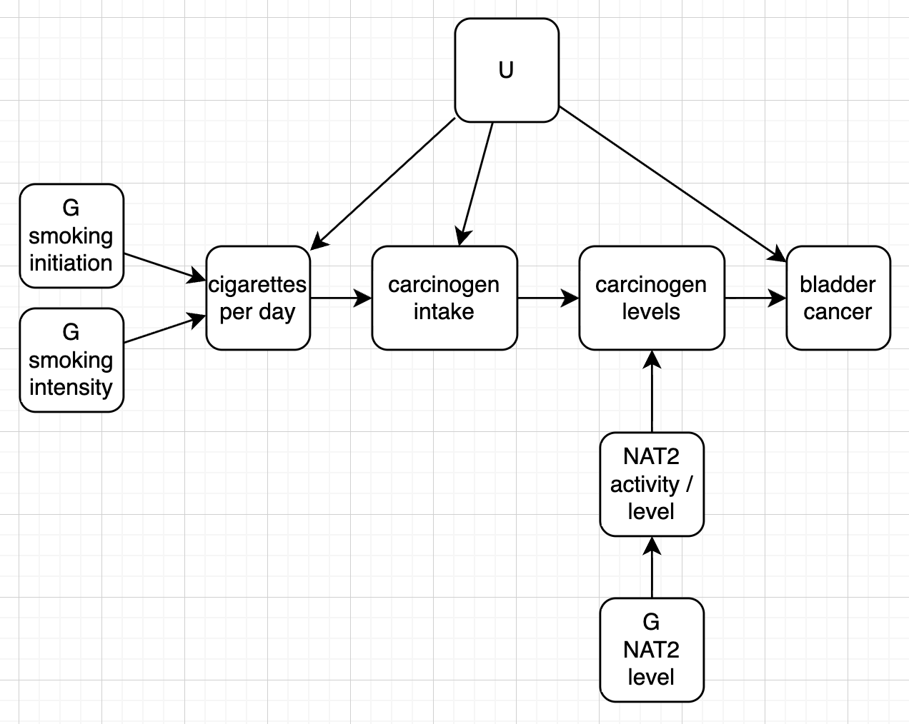

## Background

This is the relationship between smoking and bladder cancer risk stratified by NAT2 genotype (rapid vs slow acetylators).



```{r}
library(dplyr)
library(ggplot2)
ss <- tibble(
    Group = rep(factor(c("Nonsmoker", "Occasional smoker", "Former smoker", "Current smoker"), levels = c("Nonsmoker", "Occasional smoker", "Former smoker", "Current smoker")), times = 2),
    NAT2_group = rep(c("Rapid", "Slow"), each = 4),
    OR = c(1.0, 1.2, 2.4, 5.2, 0.9, 1.6, 4.1, 7.5)
) 
ggplot(ss, aes(x = Group, y = OR, group = NAT2_group, color = NAT2_group)) +
    geom_line() +
    geom_point() +
    theme_bw() +
    labs(y = "Odds Ratio for bladder cancer", color = "NAT2 genotype")
```

The hypothesised mechanism is that slow acetylators have a reduced ability to detoxify carcinogens in tobacco smoke, leading to higher levels of DNA damage and increased bladder cancer risk.

Here we will develop a simulation to examine if an interaction is required at all to explain the finding. Our model will be

$$
\text{logit}(P(Y=1)) = \beta_0 + \beta_{H,Y} H + E_Y
$$

$$
H = \beta_{S,H} C + \beta_{N,Y} N + \beta_{U,H} U + E_H
$$

$$
N = \beta_{G_N,N} G_N + E_N
$$

Smoking is represented as cigarettes per day, where G_I influences ever/never smoking and G_C influences number of cigarettes smoked per day among smokers.

$$
logit(P(S=1)) = \beta_{G_I,S} G_I + \beta_{U,S} U + E_S
$$

$C_i = 0$ if $S_i = 0$, otherwise 

$$
C = \beta_{G_C,C} G_C + \beta_{U,C} U + E_C
$$


where

- $N$ is the NAT2 gene activity level
- $H$ is the level of heterocyclic amines / carcinogens
- $S$ is smoking initiation (0 for never, 1 for ever)
- $C$ is the number of cigarettes smoked per day
- $Y$ is bladder cancer status (0/1)
- $G_1$ is the NAT2 genotype (0 for rapid, 1 for slow)


The 8:18415371:A:G variant (rs1495741) is an eQTL for NAT2 expression and is also associated with bladder cancer risk (https://www.ebi.ac.uk/gwas/variants/rs1495741).


```{r}
dgm <- function(b_0, b_hy, b_uy, b_sh, b_nh, b_gcc, b_gis, b_gnn, b_us, b_uc, b_uh, n) {
    U <- runif(n)
    Gc <- rbinom(n, 2, 0.5)
    Gi <- rbinom(n, 2, 0.5)
    Gn <- rbinom(n, 1, 0.5) + 1
    logit_S <- b_gis * Gi + b_us * U + rnorm(n)
    S <- rbinom(n, 1, exp(logit_S) / (1 + exp(logit_S)))
    C <- ifelse(S == 0, 0, rpois(n, lambda = b_gcc * Gc + b_uc * U))
    N <- b_gnn * Gn + rnorm(n)
    H_intake <- b_sh * C + b_uh * U + rnorm(n) 
    H <- H_intake * N * b_nh
    logit_p <- b_0 + b_hy * H + b_uy * U
    p <- exp(logit_p) / (1 + exp(logit_p))
    Y <- rbinom(n, 1, p)
    Ccat <- cut(C, breaks=c(-Inf, 0, 1, 2, 3, Inf), labels=c("0", "1", "2", "3", "4+"))    
    tibble(Y = Y, H = H, U = U, S = S, C = C, N = N, Gc = Gc, Gi = Gi, Gn = Gn, Ccat = Ccat)
}

estimation_gc2005 <- function(data) {
    # Estimate the effect of smoking on bladder cancer risk stratified by NAT2 genotype
    model <- glm(Y ~ C * Gn, data = data, family = binomial)
    summary(model)
}

dat <- dgm(
    b_0 = -3,
    b_hy = 0.5,
    b_uy = 0,
    b_sh = 0.4,
    b_nh = 0.2,
    b_gcc = 1.0,
    b_gis = 1.0,
    b_gnn = 1.0,
    b_us = 0,
    b_uc = 0,
    b_uh = 0,
    n = 1000000
)

dat

estimation_gc2005(dat)

```


```{r}
table(dat$Ccat)

plot_dat <- function(dat) {
    ggplot(dat, aes(x = Ccat, y = Y, group = Gn, color = factor(Gn))) +
        geom_line(stat = "summary", fun = "mean") +
        geom_point(stat = "summary", fun = "mean") +
        labs(x = "Cigarettes per day (categorised)", y = "Proportion with bladder cancer", color = "NAT2 genotype") +
        theme_bw()
}


```


```{r}
dat <- dgm(
    b_0 = -3,
    b_hy = 0.5,
    b_uy = 0,
    b_sh = 0,
    b_nh = 0.2,
    b_gcc = 1.0,
    b_gis = 1.0,
    b_gnn = 1.0,
    b_us = 0.4,
    b_uc = 0.4,
    b_uh = 0.8,
    n = 5000000
)
estimation_gc2005(dat)
ggplot(dat, aes(x = Ccat, y = Y, group = Gn, color = factor(Gn))) +
    geom_line(stat = "summary", fun = "mean") +
    geom_point(stat = "summary", fun = "mean") +
    labs(x = "Cigarettes per day (categorised)", y = "Proportion with bladder cancer", color = "NAT2 genotype") +
    theme_bw()


```


---

```{r}
sessionInfo()
```
